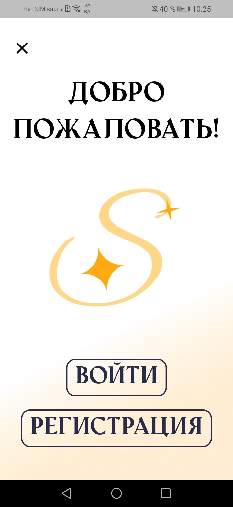
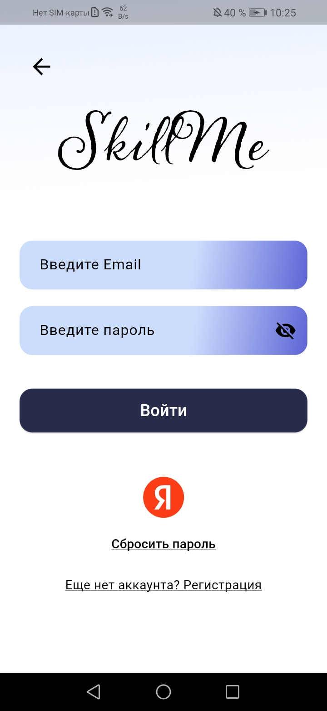
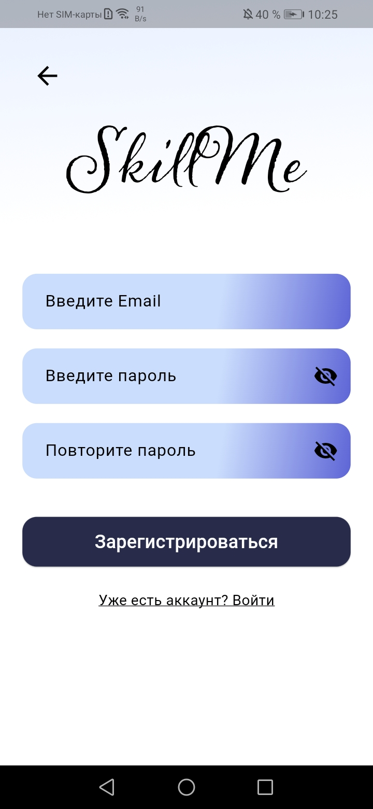
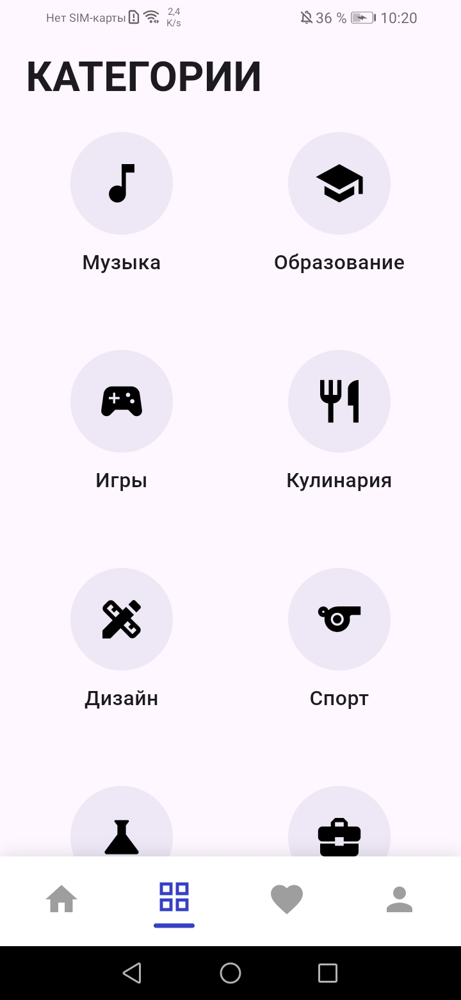
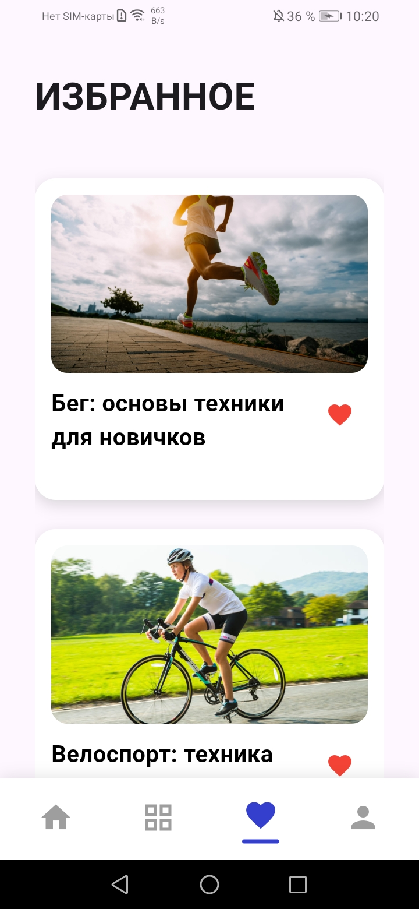
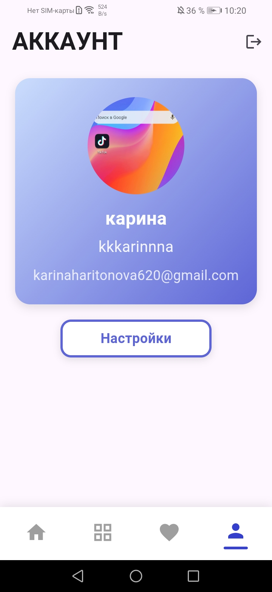
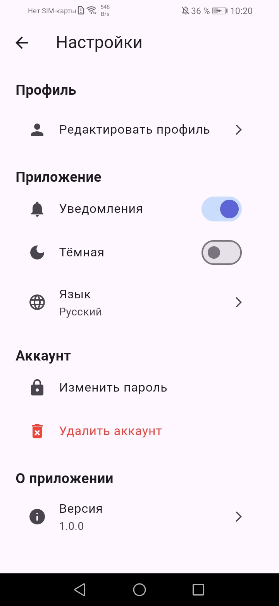
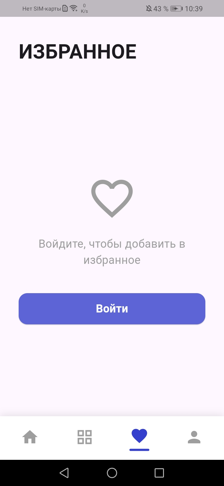

# 📱 SkillMe

Видеоплатформа для обучения, где весь контент разделён на категории (игры, кулинария, музыка, наука и т.д.). Выберите интересующую категорию, смотрите обучающие видео и развивайте свои навыки!


## ✨ Основные возможности

### 🎬 Контент
- **Категории видео** — музыка, образование, игры, кулинария, дизайн, спорт, наука, бизнес
- **Поиск** — быстрый поиск по названию и категории
- **Видеоплеер** — полноэкранный плеер с управлением воспроизведением

### 👤 Пользователь
- **Авторизация** — email/пароль, Яндекс ID
- **Верификация email** — подтверждение регистрации
- **Профиль** — аватар, имя, никнейм
- **Избранное** — сохраняйте любимые видео
- **Push-уведомления** — получайте уведомления о новом контенте

### ⚙️ Настройки
- **Тёмная/светлая тема**
- **Мультиязычность** — русский и английский языки
- **Управление уведомлениями**
- **Смена пароля**
- **Удаление аккаунта**


## 🛠️ Технологии

### Frontend
- **Flutter** — кроссплатформенный фреймворк
- **Provider** — управление состоянием
- **video_player** — воспроизведение видео
- **flutter_cache_manager** — кэширование файлов
- **cached_network_image** — кэширование изображений
- **image_picker** — выбор изображений

### Backend
- **Firebase Authentication** — авторизация пользователей
- **Cloud Firestore** — база данных
- **Firebase Cloud Messaging** — push-уведомления
- **Supabase Storage** — хранение видео

### Дополнительно
- **shared_preferences** — локальное хранение настроек
- **flutter_dotenv** — переменные окружения
- **email_validator** — валидация email


## 📁 Структура проекта
```
lib/
── main.dart # Точка входа в приложение
├── firebase_options.dart # Конфигурация Firebase
├── admin_categories_page.dart # Админ-панель категорий
│
├── assets/
│ └── images/ # Изображения и ресурсы
│
├── fonts/ # Шрифты приложения
│
├── model/
│ └── profile.dart # Модель пользователя
│
├── pages/
│ ├── registration/ # Авторизация и регистрация
│ │ ├── change_password_page.dart
│ │ ├── email_page.dart
│ │ ├── login_page.dart
│ │ ├── profile_page.dart
│ │ ├── reset_password_page.dart
│ │ └── signup_page.dart
│ │
│ ├── account_page.dart # Страница аккаунта
│ ├── admin_upload_page.dart # Загрузка видео (админ)
│ ├── categories_page.dart # Категории видео
│ ├── dobro_pozalovat_page.dart # Страница приветствия
│ ├── edit_profile_page.dart # Редактирование профиля
│ ├── favorite_page.dart # Избранные видео
│ ├── first_page.dart # Главная навигация
│ ├── home_page.dart # Домашняя страница
│ ├── nickname_page.dart # Создание никнейма
│ ├── settings_page.dart # Настройки
│ ├── snack_bar.dart # Кастомные уведомления
│ ├── video_player_page.dart # Видеоплеер
│ └── videos_by_category_page.dart # Видео по категории
│
├── services/ # Сервисы и API
│ ├── api_health.dart # Проверка API
│ ├── internet_checker.dart # Проверка интернета
│ ├── local_cache.dart # Локальное кэширование
│ ├── network_service.dart # Сетевые запросы
│ ├── no_internet_page.dart # Страница "нет интернета"
│ ├── video_repository.dart # Репозиторий видео
│ └── yandex_auth.dart # Авторизация через Яндекс
│
├── utils/ # Утилиты и провайдеры
│ ├── app_strings.dart # Локализация
│ ├── language_provider.dart # Провайдер языка
│ ├── theme_provider.dart # Провайдер темы
│ ├── user_preferences.dart # Настройки пользователя
│ ├── video_service.dart # Сервис видео
│ └── video_uploader.dart # Загрузчик видео
│
└── widget/ # Переиспользуемые виджеты
├── appbar_widget.dart # Кастомная AppBar
├── buttom_widget.dart # Кастомные кнопки
├── profile_widget.dart # Виджет профиля
└── splash_screen.dart # Экран загрузки
```

## 🌍 Локализация

Приложение поддерживает два языка:
- 🇷🇺 Русский (по умолчанию)
- 🇬🇧 English

Переключение языка: **Настройки → Язык**

Все строки хранятся в `lib/utils/app_strings.dart`.


## 📱 Скриншоты

<div align="center">
  <table>
    <tr>
      <td align="center">
        <h4>👋 Добро пожаловать</h4>
        
      </td>
      <td align="center">
        <h4>🔐 Вход</h4>
        
      </td>
      <td align="center">
        <h4>📝 Регистрация</h4>
        
      </td>
    </tr>
    <tr>
      <td align="center">
        <h4>🏠 Главная</h4>
        
      </td>
      <td align="center">
        <h4>📂 Категории</h4>
        
      </td>
      <td align="center">
        <h4>❤️ Избранное</h4>
        
      </td>
    </tr>
    <tr>
      <td align="center">
        <h4>👤 Аккаунт</h4>
        
      </td>
      <td align="center">
        <h4>⚙️ Настройки</h4>
        
      </td>
      <td align="center">
        <h4>❤️ Избранное</h4>
        
      </td>
    </tr>
  </table>
</div>


## 📦 Установка и запуск

### Требования
- Flutter SDK (3.0+)
- Dart SDK (2.17+)
- Android Studio / VS Code
- Firebase проект
- Supabase проект

### Шаги установки

1. **Клонируйте репозиторий:**
```bash
git clone https://github.com/karinaharitonova/SkillMe.git
cd SkillMe
```

2. **Установите зависимости:**
```bash
flutter pub get
```

3. **Настройте Firebase:**
   - Создайте проект в [Firebase Console](https://console.firebase.google.com/)
   - Скачайте `google-services.json` (Android) и/или `GoogleService-Info.plist` (iOS)
   - Поместите файлы в соответствующие папки:
     - Android: `android/app/google-services.json`
     - iOS: `ios/Runner/GoogleService-Info.plist`

4. **Настройте Supabase:**
   - Создайте проект в [Supabase](https://supabase.com/)
   - Создайте bucket `videos` в Storage
   - Скопируйте URL и Anon Key

5. **Создайте файл `.env`** в корне проекта:
```env
SUPABASE_URL=your_supabase_url
SUPABASE_ANON_KEY=your_supabase_anon_key
API_KEY=your_api_key
```

6. **Инициализируйте Firestore:**
   - Создайте коллекции: `videos`, `favorites`, `deviceTokens`, `users`
   - Настройте правила безопасности

7. **Запустите приложение:**
```bash
flutter run
```
